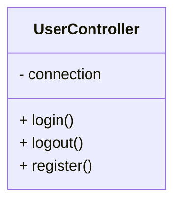
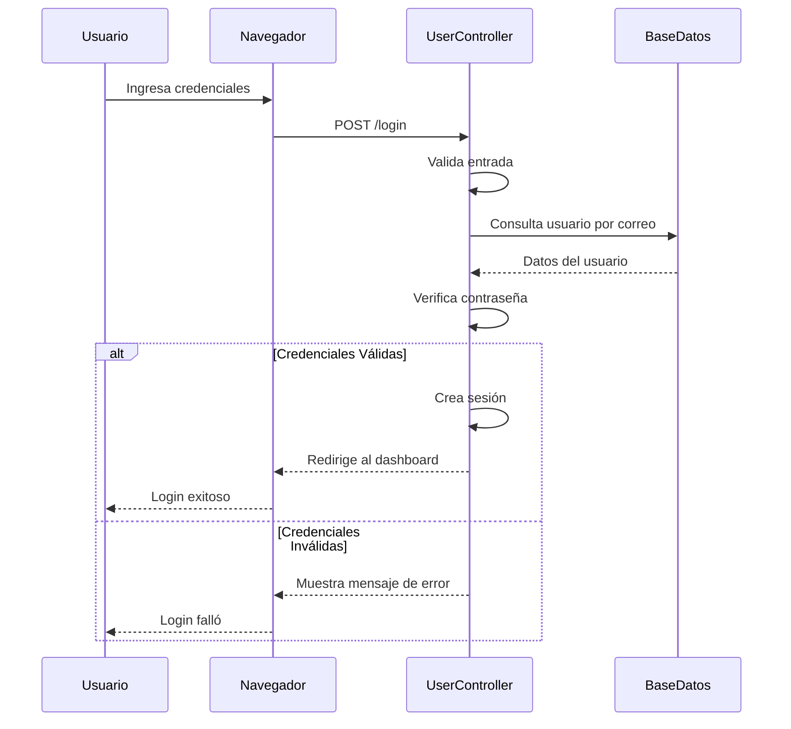
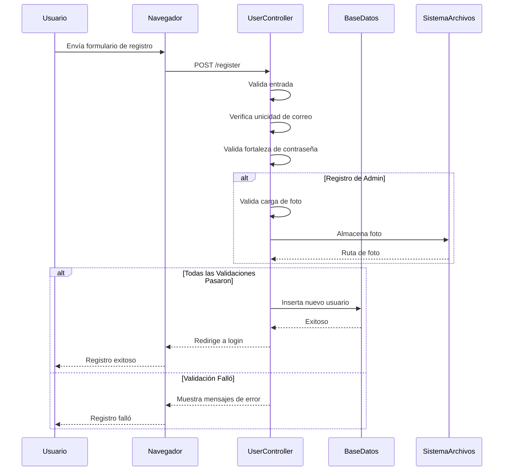

# 🌙 NightFest - Sistema de Gestión de Usuarios

## Introducción

NightFest es un sistema robusto de gestión de usuarios basado en PHP, construido con la arquitectura MVC (Modelo-Vista-Controlador). Proporciona una plataforma segura para el registro de usuarios, autenticación y características administrativas. El sistema está diseñado para manejar tanto el registro de usuarios estándar como el registro administrativo con capacidades de carga de fotos, garantizando la integridad de los datos a través de validaciones exhaustivas del lado del servidor.

## Funcionalidades

### 🔐 Características Principales

- **Registro Estándar**: Los usuarios pueden crear cuentas con nombre de usuario, correo electrónico y contraseña
- **Registro de Admin con Foto**: Los usuarios administrativos pueden registrarse con una función adicional de carga de fotos
- **Sistema de Login**: Autenticación segura usando credenciales validadas
- **Sistema de Logout**: Terminación segura de sesiones y limpieza
- **Validaciones del Servidor**: 
  - Validación de formato de correo electrónico
  - Requisitos de fortaleza de contraseña
  - Verificación de unicidad de nombre de usuario
  - Sanitización de entrada y controles de seguridad
  - Validación de carga de archivos para fotos

## Cómo Funciona

### Diagrama de Clase UserController



### Arquitectura del Sistema

El sistema sigue el patrón MVC con la siguiente estructura:

```
├── src/
│   ├── Controller/          # Controladores de la aplicación
│   ├── view/                # Plantillas de interfaz de usuario
│   └── assets/              # Archivos estáticos (CSS, JS, imágenes)
├── model/
│   └── db.sql               # Esquema de base de datos
└── config/
    └── db.php               # Configuración de conexión a la base de datos
```

## Diagrama de Secuencia de Login

El proceso de login valida las credenciales del usuario y establece una sesión:



## Diagrama de Secuencia de Registro

El proceso de registro maneja tanto el registro de usuario estándar como el administrativo:



## Requisitos Técnicos

- **PHP** 8.x o superior
- **MySQL** 5.7 o superior
- **Arquitectura**: MVC (Modelo-Vista-Controlador)
- **Driver de Base de Datos**: MySQLi (Orientado a Objetos)
- **Servidor Web**: Apache con mod_rewrite habilitado

## Instalación

1. **Clonar el repositorio**
   ```bash
   git clone <repository-url>
   cd project1.dis
   ```

2. **Importar la base de datos**
   ```bash
   mysql -u <usuario> -p <nombre_base_datos> < model/db.sql
   ```

3. **Configurar la conexión a la base de datos**
   - Edita `config/db.php` con tus credenciales de base de datos:
   ```php
   $host = 'localhost';
   $user = 'tu_usuario';
   $password = 'tu_contraseña';
   $database = 'nombre_tu_base_datos';
   ```

4. **Inicia tu servidor web**
   ```bash
   php -S localhost:8000
   ```

## Uso

### Registro de Usuario
- Navega a la página de registro
- Completa tus detalles (nombre de usuario, correo electrónico, contraseña)
- Para registro de admin, incluye una foto de perfil
- Envía el formulario para validación y creación de cuenta

### Login de Usuario
- Visita la página de login
- Ingresa tu correo electrónico y contraseña
- Haz clic en login para acceder a tu cuenta

### Características de Admin
- Registrarse con privilegios administrativos
- Subir y gestionar fotos de perfil
- Acceder al panel de administración para gestión de usuarios

## Características de Seguridad

- Encriptación de contraseñas usando algoritmos seguros
- Validación y sanitización de entrada
- Prevención de inyección SQL mediante declaraciones preparadas
- Gestión de sesiones para autenticación de usuarios
- Validación y restricciones de carga de archivos

## Estructura de Archivos

```
NightFest/
├── src/
│   ├── Controller/          # Controladores de lógica de negocios
│   ├── view/                # Plantillas HTML
│   └── assets/              # CSS, JavaScript, imágenes
├── model/
│   └── db.sql               # Esquema de base de datos y tablas
├── config/
│   └── db.php               # Configuración de la base de datos
└── README.md                # Este archivo
```
